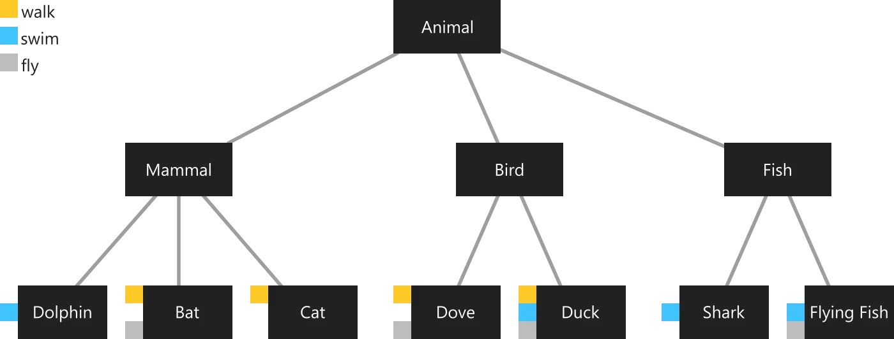

# `Flutter - Movil de Cero a experto 2023`

### Sección 2: Introducción a Dart
Temas puntuales de la sección
Esta es una sección introductoria para personas que nunca han tocado Dart en su vida, o quieren tener la base necesaria para tomar este curso de Flutter.

*Temas puntuales*:

- Hola Mundo
- Tipos de datos
- Estructuras de colección de datos
- Tipos de parámetros
- Clases
- Diferentes constructores
- Getters y Setters
- Extends, Implements y Mixins
- Futures
- Streams
- Async, Async* y Await
- Decoradores (@override)
- Y más..

El objetivo es darles a ustedes una introducción a Dart para que se sientan cómodos trabajando en el lenguaje, es muy similar a otros, y su curva de aprendizaje no es difícil, pero tengan presente que cada persona aprende a ritmos diferentes.

#### `8. ¿Qué es Dart? - Exposición`
Es un lenguaje de programación, de lado del cliente optimizado para aplicaciónes.
- Optimizado para el UI.
  - Todo fue pensado en su creación para trabajar con flutter.
- Permite el Hot Reload.
  - Es supremamente rapido para el desarrollo, se cambian piezas y se ven reflejadas en segundos.
- Rapido en todas las plataformas (ARM & x64).

Escribimos el codigo de Flutter en Dart, seguimos lineamientos y termina siendo compilado a codigo de movil.


#### `9. Hola Mundo - Dart`
[https://dartpad.dev](https://dartpad.dev)

// Formas de definir variables
```dart
var myName = 'Jhonatan'; // Dart infiere el valor de la variable
String myName = 'Jhonatan'; // Dart toma el valor según la definición
final myName = 'Jhonatan'; // Funciona similar a una constante pero no es lo mismo.
late final = 'Jhonatan'; // Late permite decirle a Dart que esa variable tendrá un valor al momento de usarse, es responsabilidad del desarrollador asegurar que eso se cumpla.

const myName = 'Jhonatan ñandú';  
print('Hola $myName');
print('Hola ${myName.toUpperCase()}'); // Interpolación de string
```


#### `10. Tipos de variables`

```dart
void main() {
  final String pokemon = 'Ditto';
  final int hp = 100;
  final bool isAlive = true;
  final List<String> abilities = ['impostor'];
  final sprites = <String>['ditto/front.png', 'ditto.png'];
  
  print("""
  $pokemon
  $hp
  $isAlive
  $abilities
  $sprites
  """);
}
```


#### `11. Dynamic type`
Se debe evitar usar el tipo dinamico, pero se debe encontrar un balance para utilizar algunas veces.
Por defecto es null.
el nullsafety es dart diciendo si una variable puede ser nula o no.


#### `12. Maps`
```dart
void main() {
  final Map<String, dynamic>pokemon = {
    'name': 'Ditto',
    'hp': 100,
    'isAlive': true,
    'abilities': <String>['emulation'],
    'sprites': {
      1: 'front_ditto.png',
      2: 'back_ditto.jpg'
    }
  };
  
  
  print(pokemon);
  
  print('Name: ${ pokemon['name'] }');
  print('Images: ${ pokemon['sprites'] }');
  print('Front: ${ pokemon['sprites'][1] }');
  print('Back: ${ pokemon['sprites'][2] }');
  
}
```


#### `13. List, iterables y Sets`

Listado: `[]`
Iterable: `()` Es una colección de elementos que se puede leer de manera secuencial. Es un objeto que puede contar elementos que se encuentren dentro de él, como listas, sets, arreglos, etc.
Set: `{}` Similar a los mapas, pero solo tiene datos que no son duplicados.

#### `14. Funciones y parámetros`

```dart
void main() {  
  print(greetEveryone());
  print('Suma: ${ addTwoNumbers(10,5) }');
}

String greetEveryone() => 'Hello';

/*int addTwoNumbers( int a, int b ) {
   return a + b;
}*/

int addTwoNumbers( int a, int b ) => a + b;


int addTwoNumbersOptional( int a, [int b = 0] ) {
  // b = b ?? 0;
  // b ??= 0;
  return a + b;
}
```

#### `15. Parámetros con nombre`
En flutter podemos mandar parametros con nombres que saltaran el posicionamiento de las variables.

```dart
void main() {  
  print(greetPerson( name: 'Jhonatan', message: 'Hi' ));
}

String greetPerson( { required String name, String message = 'Hola' } ) {
  return '$message, $name';
}
```


#### `16. Clases`

Son la representactión digital de los objetos en el mundo real.
En dart el constructor tiene el mismo nombre de la clase.

```dart
void main() {
  final Hero wolverine = Hero('Wolverine','Regeneración');
  print( wolverine );
  print( wolverine.name );
  print( wolverine.power );
}

class Hero {
  String name;
  String power;
  
  Hero(this.name, this.power);
}
```

#### `17. @override`
_@override_ nos permite sobreescribir metodos de una clase para darle nuestro propia funcionalidad especifica a este metodo.

```dart
void main() {
  //final Hero wolverine = Hero( name: 'Wolverine', power: 'Regeneración');
  final Hero wolverine = Hero( name: 'Wolverine');
  print( wolverine ); // por default dart invoca toString().
  print( wolverine.name );
  print( wolverine.power );
}

class Hero {
  String name;
  String power;
  
  Hero({
    required this.name, 
    this.power = 'Sin poder'
  });
  
  @override
  String toString() {
    return 'su nombre es: $name y su poder es: $power';
  }
}
```


#### `18. Name constructors`  

Podemos crear mas de un constructor con nombres diferentes para identificarlos

```dart
void main() { 
  
  final Map<String, dynamic> rawJson = {
     'name': 'Tony',
     'power': 'Money',
     'isAlive': true
  };
  
  final ironman = Hero.fromJson(rawJson);
  
  print( ironman );
}

class Hero {
  String name;
  String power;
  bool isAlive;
  
  Hero({
    required this.name,
    required this.power,
    required this.isAlive
  });
  
  Hero.fromJson( Map<String, dynamic> json )
    : name = json['name'] ?? 'name not found',
      power = json['power'] ?? 'power not found',
      isAlive = json['isAlive'] ?? 'isAlive not found';
  
  @override
  String toString() {
    return '$name su poder es $power su estado es ${ isAlive ? 'Vivo' : 'Muerto' }';
  }
}
```


#### `19. getters y setters`

Para poner entidades privadas deben ir especificadas con guíon bajo `_square`.

```dart
void main() {
  final mySquare = Square( side: 10 );
  mySquare.side = -5;
  print('área ${ mySquare.calculateArea() }');
}

class Square {
  double _side;
  
  Square({ required double side })
    : _side = side;
  
  
  double get area {
    return _side * _side;
  }
  
  set side(double value) {
    print('setting value $value');
    if( value < 0 ) throw 'value must be >=0';
    _side = value;
  }
  
  double calculateArea() {
    return _side * _side;
  }
}
```

#### `20. Aserciones`
Las aserciones dan la posibilidad de enviar un segundo parametro con un mensaje mas especifico de error.
```dart
NonNegativePoint(this.x, this.y)
    : assert(x >= 0),
      assert(y >= 0) {
  print('Punto no negativo: ($x, $y)');
}
```

#### `21. Clases abstractas y enumeraciones`
Una clase abstracta no se puede instanciar por si misma, es usada para instanciar estructuras en otras clases.

```dart
void main() {
  final windPlant = EnergyPlant();
}

enum PlantType { nuclear, wind, water }

abstract class EnergyPlant {
 double energyLeft;
 PlantType type; // nuclear, wind, water
  
  EnergyPlant({
    required this.energyLeft,
    required this.type
  });
  
  void consumeEnergy( double amount );
  
}
```
#### `22. Extends`
Teniendo nuestro molde para plantas de energia continuamos con la explicación de extends.
Se implementa la clase y se demuestra el funcionamiento del uso de la clase abstracta.

Cuando extendemos hacemos uso de la herencia.


#### `23. Implements`
Implementar es mas especifico, mientras que extender es mas general


#### `24. Mixins`

Es una implementación muy utilizada en Dart donde una clase tiene subclasses y estas subclasses tienen implementación en clases concretas



#### `25 Ejercicio con Mixins`  

```dart
abstract class Animal {}

abstract class Mamifero extends Animal {}

abstract class Ave extends Animal {}
abstract class Pez extends Animal {}

abstract class Volador {
  void volar() => print('Estoy volando');
}

abstract class Caminador {
  void caminar() => print('Estoy caminando');
}

abstract class Nadador {
  void nadar() => print('Estoy nadando');
}

class Delfin extends Mamifero with Nadador{}
class Murcielago extends Mamifero with Volador, Caminador{}
class Gato extends Mamifero with Caminador{}

class Paloma extends Ave with Volador, Caminador{}
class Pato extends Ave with Caminador, Nadador, Volador{}
class Tiburon extends Pez with Nadador{}
class PezVolador extends Pez with Nadador, Volador{}


void main() {
  final flipper = Delfin();
  flipper.nadar();
  
  final batman = Murcielago();
  batman.caminar();
  batman.volar();
  
  final lucas = Pato();
  lucas.caminar();
  lucas.volar();
  lucas.nadar();
}
```

#### `26. Futures`
Un Future representa principalmente el resultado de
una operación asíncrona. Es una promesa de que
pronto tendrás un valor. La promesa puede falla y hay
que manejar la excepción. Los futures son un acuerdo
de que en el futuro tendrás un valor para ser usado.


#### `27. Async - Await`

```dart
 void main() async {
   print("inicio");
   try {
    final value = await httpGet('hhhhhhhhhhhhhhhhh');
    print(value);     
   } catch(err) {
     print('Tenemos un error $err');
   }
   print("fin");
 }

Future<String> httpGet( String url ) async {  
  await Future.delayed( const Duration(seconds: 1) );
  throw 'Error en la petición';
  //return 'valor http';
}
```

#### `28. Try, on, catch y finally`
Se pueden agrupar los errores por tipo.

```dart
 void main() async {
   print("inicio");
   try {
     final value = await httpGet('hhhhhhhhhhhhhhhhh');
     print('exito $value');
   } on Exception catch(err){
     print('Tenemos una exception $err');
   } catch(err) {
     print('Algo terrible paso... $err');
   } finally {
     print('fin de trycatch');
   }
   print("fin");
 }

Future<String> httpGet( String url ) async {  
  await Future.delayed( const Duration(seconds: 1) );
  //throw 'aaaaaaaaaaaaaah';
  throw Exception('No hay parametros en el URL');
  //return 'valor http';
}
```